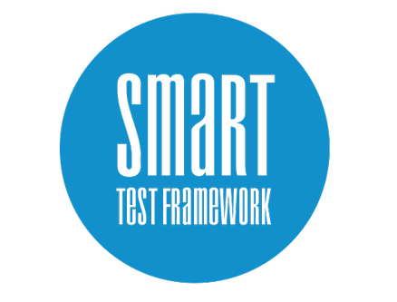

# Welcome to Smart-Test-Framework (STF) Kick off Project!

## What's this repo objective?
 In case you want to start using STF, you'll just need to clone this repo content and start using it as base to create your own tests.
 It has real tests with a lot of examples of STF API usages for Web Ui, Mobile, Desktop applications and Rest services.of pretty much all STF API Pretty much all examples you might need are a

### What is Smart Test Framework?
Smart Test Framework is multi-purpose test framework composed by four independent libraries. You’ll be able to create automated tests for Web pages (via desktop and mobile web browsers), Web services (REST APis), Desktop applications (on Windows, Mac and Linux) and Mobile applications (native and hybrid). It's flexible enough to support most of projects and to provide professional quality to automated test needs.

### What can be tested with Smart Test Framework?
- Web pages (via desktop and mobile web browsers)
- Web services (REST APis)
- Desktop applications (on Windows, Mac and Linux)
- Mobile applications (native and hybrid)

Read Smart Test Framework official documentation at [github.com/HPInc/smart-test-framework](https://github.com/HPInc/smart-test-framework)
### Contact
Jean Giacomin > jeansantos38@gmail.com
